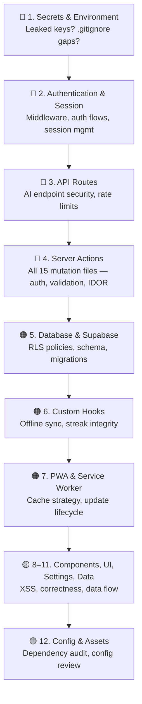

# Prayer Tracker — Comprehensive Audit Map

> **Stack**: Next.js 14 (App Router) · React 18 · Supabase (Auth + Postgres) · TailwindCSS 3 · OneSignal · Vercel · PWA (custom SW)

> [!IMPORTANT]
> This map covers **all source files** (non-`node_modules`, non-`.next` build output). Review and approve before any code-level analysis begins.

---

## Audit Map

| # | Module Name | File Paths | Scope / Function | Audit Priority |
|---|-------------|-----------|------------------|----------------|
| 1 | **🔐 Authentication & Session** | [middleware.ts](file:///c:/Users/HP/Desktop/prayer-tracker-FINAL/middleware.ts) · [auth/layout.tsx](file:///c:/Users/HP/Desktop/prayer-tracker-FINAL/app/auth/layout.tsx) · [auth/login/page.tsx](file:///c:/Users/HP/Desktop/prayer-tracker-FINAL/app/auth/login/page.tsx) · [auth/signup/page.tsx](file:///c:/Users/HP/Desktop/prayer-tracker-FINAL/app/auth/signup/page.tsx) · [auth/magiclink/page.tsx](file:///c:/Users/HP/Desktop/prayer-tracker-FINAL/app/auth/magiclink/page.tsx) · [auth/magiclink/callback/page.tsx](file:///c:/Users/HP/Desktop/prayer-tracker-FINAL/app/auth/magiclink/callback/page.tsx) · [lib/actions/auth.ts](file:///c:/Users/HP/Desktop/prayer-tracker-FINAL/lib/actions/auth.ts) | Route-level auth guard (middleware), Supabase session refresh, login/signup/magic-link flows, OAuth callback handling, server-side auth actions. **Attack surface**: session hijacking, unauthenticated access, CSRF, open redirects. | **🔴 Critical** |
| 2 | **🔑 Secrets & Environment** | [.env](file:///c:/Users/HP/Desktop/prayer-tracker-FINAL/.env) · [.env.local](file:///c:/Users/HP/Desktop/prayer-tracker-FINAL/.env.local) · [.gitignore](file:///c:/Users/HP/Desktop/prayer-tracker-FINAL/.gitignore) | All API keys (Supabase service-role, Gemini API, OneSignal REST API, Vercel OIDC token). `.env` is **committed and 2 KB** — potential secret leak. `.gitignore` controls what is excluded from VCS. | **🔴 Critical** |
| 3 | **🌐 API Routes (Server)** | [api/explain-ayah/route.ts](file:///c:/Users/HP/Desktop/prayer-tracker-FINAL/app/api/explain-ayah/route.ts) · [api/weekly-insight/route.ts](file:///c:/Users/HP/Desktop/prayer-tracker-FINAL/app/api/weekly-insight/route.ts) | Server-side Next.js route handlers exposed to the internet. `explain-ayah` calls the Gemini AI API; `weekly-insight` generates personalized reports (19 KB — largest route). **Attack surface**: injection, auth bypass, rate limiting, cost abuse of external AI API. | **🔴 Critical** |
| 4 | **⚙️ Server Actions (Data Mutations)** | [lib/actions/prayers.ts](file:///c:/Users/HP/Desktop/prayer-tracker-FINAL/lib/actions/prayers.ts) · [lib/actions/friends.ts](file:///c:/Users/HP/Desktop/prayer-tracker-FINAL/lib/actions/friends.ts) · [lib/actions/challenges.ts](file:///c:/Users/HP/Desktop/prayer-tracker-FINAL/lib/actions/challenges.ts) · [lib/actions/qada.ts](file:///c:/Users/HP/Desktop/prayer-tracker-FINAL/lib/actions/qada.ts) · [lib/actions/quran.ts](file:///c:/Users/HP/Desktop/prayer-tracker-FINAL/lib/actions/quran.ts) · [lib/actions/calendar.ts](file:///c:/Users/HP/Desktop/prayer-tracker-FINAL/lib/actions/calendar.ts) · [lib/actions/stats.ts](file:///c:/Users/HP/Desktop/prayer-tracker-FINAL/lib/actions/stats.ts) · [lib/actions/settings.ts](file:///c:/Users/HP/Desktop/prayer-tracker-FINAL/lib/actions/settings.ts) · [lib/actions/badges.ts](file:///c:/Users/HP/Desktop/prayer-tracker-FINAL/lib/actions/badges.ts) · [lib/actions/notifications.ts](file:///c:/Users/HP/Desktop/prayer-tracker-FINAL/lib/actions/notifications.ts) · [lib/actions/nudge.ts](file:///c:/Users/HP/Desktop/prayer-tracker-FINAL/lib/actions/nudge.ts) · [lib/actions/reflection.ts](file:///c:/Users/HP/Desktop/prayer-tracker-FINAL/lib/actions/reflection.ts) · [lib/actions/scheduleNotifications.ts](file:///c:/Users/HP/Desktop/prayer-tracker-FINAL/lib/actions/scheduleNotifications.ts) · [lib/actions/weeklyReport.ts](file:///c:/Users/HP/Desktop/prayer-tracker-FINAL/lib/actions/weeklyReport.ts) | 15 server action files — the entire write-path for the app. Prayers, social (friends/challenges/nudge), gamification (badges, streaks), push notifications, user settings. **Attack surface**: authorization (IDOR), input validation, SQL injection (if raw queries), data integrity. | **🔴 Critical** |
| 5 | **🗄️ Database & Supabase Infrastructure** | [lib/supabase/client.ts](file:///c:/Users/HP/Desktop/prayer-tracker-FINAL/lib/supabase/client.ts) · [lib/supabase/server.ts](file:///c:/Users/HP/Desktop/prayer-tracker-FINAL/lib/supabase/server.ts) · [lib/schema.sql](file:///c:/Users/HP/Desktop/prayer-tracker-FINAL/lib/schema.sql) · [supabase/migrations/20240001_qada_log.sql](file:///c:/Users/HP/Desktop/prayer-tracker-FINAL/supabase/migrations/20240001_qada_log.sql) · [supabase/migrations/20240002_notifications.sql](file:///c:/Users/HP/Desktop/prayer-tracker-FINAL/supabase/migrations/20240002_notifications.sql) · [supabase/migrations/20240003_quran_progress.sql](file:///c:/Users/HP/Desktop/prayer-tracker-FINAL/supabase/migrations/20240003_quran_progress.sql) · [supabase/migrations/20240004_friend_activity.sql](file:///c:/Users/HP/Desktop/prayer-tracker-FINAL/supabase/migrations/20240004_friend_activity.sql) · [supabase/migrations/20240005_streak_freeze.sql](file:///c:/Users/HP/Desktop/prayer-tracker-FINAL/supabase/migrations/20240005_streak_freeze.sql) · [supabase/migrations/20240006_challenges.sql](file:///c:/Users/HP/Desktop/prayer-tracker-FINAL/supabase/migrations/20240006_challenges.sql) | Supabase client initialization (client-side & server-side), full DB schema, and 6 incremental migrations. Defines RLS policies, foreign keys, indexes, and stored procedures. **Attack surface**: RLS policy gaps, privilege escalation, missing constraints, migration ordering. | **🟠 High** |
| 6 | **📱 Core Feature Pages (Dashboard)** | [dashboard/layout.tsx](file:///c:/Users/HP/Desktop/prayer-tracker-FINAL/app/dashboard/layout.tsx) · [dashboard/today/page.tsx](file:///c:/Users/HP/Desktop/prayer-tracker-FINAL/app/dashboard/today/page.tsx) · [dashboard/today/TodayClient.tsx](file:///c:/Users/HP/Desktop/prayer-tracker-FINAL/app/dashboard/today/TodayClient.tsx) · [dashboard/today/loading.tsx](file:///c:/Users/HP/Desktop/prayer-tracker-FINAL/app/dashboard/today/loading.tsx) · [dashboard/today/reflection/[prayer]/page.tsx](file:///c:/Users/HP/Desktop/prayer-tracker-FINAL/app/dashboard/today/reflection/%5Bprayer%5D/page.tsx) · [dashboard/today/reflection/[prayer]/ReflectionClient.tsx](file:///c:/Users/HP/Desktop/prayer-tracker-FINAL/app/dashboard/today/reflection/%5Bprayer%5D/ReflectionClient.tsx) · [dashboard/quran/page.tsx](file:///c:/Users/HP/Desktop/prayer-tracker-FINAL/app/dashboard/quran/page.tsx) · [dashboard/quran/QuranClient.tsx](file:///c:/Users/HP/Desktop/prayer-tracker-FINAL/app/dashboard/quran/QuranClient.tsx) · [dashboard/quran/[id]/page.tsx](file:///c:/Users/HP/Desktop/prayer-tracker-FINAL/app/dashboard/quran/%5Bid%5D/page.tsx) · [dashboard/quran/[id]/SurahReader.tsx](file:///c:/Users/HP/Desktop/prayer-tracker-FINAL/app/dashboard/quran/%5Bid%5D/SurahReader.tsx) · [dashboard/duas/page.tsx](file:///c:/Users/HP/Desktop/prayer-tracker-FINAL/app/dashboard/duas/page.tsx) · [dashboard/duas/[id]/page.tsx](file:///c:/Users/HP/Desktop/prayer-tracker-FINAL/app/dashboard/duas/%5Bid%5D/page.tsx) · [dashboard/duas/category/[id]/page.tsx](file:///c:/Users/HP/Desktop/prayer-tracker-FINAL/app/dashboard/duas/category/%5Bid%5D/page.tsx) · [dashboard/calendar/page.tsx](file:///c:/Users/HP/Desktop/prayer-tracker-FINAL/app/dashboard/calendar/page.tsx) · [dashboard/calendar/loading.tsx](file:///c:/Users/HP/Desktop/prayer-tracker-FINAL/app/dashboard/calendar/loading.tsx) · [dashboard/friends/page.tsx](file:///c:/Users/HP/Desktop/prayer-tracker-FINAL/app/dashboard/friends/page.tsx) · [dashboard/friends/FriendsClient.tsx](file:///c:/Users/HP/Desktop/prayer-tracker-FINAL/app/dashboard/friends/FriendsClient.tsx) · [dashboard/friends/loading.tsx](file:///c:/Users/HP/Desktop/prayer-tracker-FINAL/app/dashboard/friends/loading.tsx) · [dashboard/stats/page.tsx](file:///c:/Users/HP/Desktop/prayer-tracker-FINAL/app/dashboard/stats/page.tsx) · [dashboard/stats/StatsClient.tsx](file:///c:/Users/HP/Desktop/prayer-tracker-FINAL/app/dashboard/stats/StatsClient.tsx) · [dashboard/stats/loading.tsx](file:///c:/Users/HP/Desktop/prayer-tracker-FINAL/app/dashboard/stats/loading.tsx) · [dashboard/tasbih/page.tsx](file:///c:/Users/HP/Desktop/prayer-tracker-FINAL/app/dashboard/tasbih/page.tsx) · [dashboard/tasbih/loading.tsx](file:///c:/Users/HP/Desktop/prayer-tracker-FINAL/app/dashboard/tasbih/loading.tsx) · [dashboard/qada/page.tsx](file:///c:/Users/HP/Desktop/prayer-tracker-FINAL/app/dashboard/qada/page.tsx) · [dashboard/qada/loading.tsx](file:///c:/Users/HP/Desktop/prayer-tracker-FINAL/app/dashboard/qada/loading.tsx) · [dashboard/rewards/page.tsx](file:///c:/Users/HP/Desktop/prayer-tracker-FINAL/app/dashboard/rewards/page.tsx) · [dashboard/rewards/RewardsClient.tsx](file:///c:/Users/HP/Desktop/prayer-tracker-FINAL/app/dashboard/rewards/RewardsClient.tsx) · [dashboard/rewards/loading.tsx](file:///c:/Users/HP/Desktop/prayer-tracker-FINAL/app/dashboard/rewards/loading.tsx) · [dashboard/qibla/page.tsx](file:///c:/Users/HP/Desktop/prayer-tracker-FINAL/app/dashboard/qibla/page.tsx) · [dashboard/qibla/QiblaClient.tsx](file:///c:/Users/HP/Desktop/prayer-tracker-FINAL/app/dashboard/qibla/QiblaClient.tsx) | All Next.js pages under `/dashboard`. Server components fetch data, client components handle interactivity. SurahReader (27 KB) and QiblaClient (19 KB) are the most complex. **Audit focus**: data-fetching correctness, user data leakage between accounts, XSS in rendered content. | **🟠 High** |
| 7 | **🧩 Feature Components** | [components/prayers/PrayerCard.tsx](file:///c:/Users/HP/Desktop/prayer-tracker-FINAL/components/prayers/PrayerCard.tsx) · [components/prayers/TodayHeader.tsx](file:///c:/Users/HP/Desktop/prayer-tracker-FINAL/components/prayers/TodayHeader.tsx) · [components/friends/ActivityFeed.tsx](file:///c:/Users/HP/Desktop/prayer-tracker-FINAL/components/friends/ActivityFeed.tsx) · [components/friends/AddFriendForm.tsx](file:///c:/Users/HP/Desktop/prayer-tracker-FINAL/components/friends/AddFriendForm.tsx) · [components/friends/ChallengeCard.tsx](file:///c:/Users/HP/Desktop/prayer-tracker-FINAL/components/friends/ChallengeCard.tsx) · [components/friends/ChallengeSender.tsx](file:///c:/Users/HP/Desktop/prayer-tracker-FINAL/components/friends/ChallengeSender.tsx) · [components/friends/ChallengesSection.tsx](file:///c:/Users/HP/Desktop/prayer-tracker-FINAL/components/friends/ChallengesSection.tsx) · [components/friends/FriendCard.tsx](file:///c:/Users/HP/Desktop/prayer-tracker-FINAL/components/friends/FriendCard.tsx) · [components/friends/Leaderboard.tsx](file:///c:/Users/HP/Desktop/prayer-tracker-FINAL/components/friends/Leaderboard.tsx) · [components/friends/PendingRequests.tsx](file:///c:/Users/HP/Desktop/prayer-tracker-FINAL/components/friends/PendingRequests.tsx) · [components/calendar/DayDetailSheet.tsx](file:///c:/Users/HP/Desktop/prayer-tracker-FINAL/components/calendar/DayDetailSheet.tsx) · [components/calendar/HijriCalendar.tsx](file:///c:/Users/HP/Desktop/prayer-tracker-FINAL/components/calendar/HijriCalendar.tsx) · [components/stats/Heatmap.tsx](file:///c:/Users/HP/Desktop/prayer-tracker-FINAL/components/stats/Heatmap.tsx) · [components/stats/PrayerBreakdown.tsx](file:///c:/Users/HP/Desktop/prayer-tracker-FINAL/components/stats/PrayerBreakdown.tsx) · [components/stats/StatsSummary.tsx](file:///c:/Users/HP/Desktop/prayer-tracker-FINAL/components/stats/StatsSummary.tsx) · [components/stats/WeeklyInsightCard.tsx](file:///c:/Users/HP/Desktop/prayer-tracker-FINAL/components/stats/WeeklyInsightCard.tsx) · [components/stats/WeeklyTrend.tsx](file:///c:/Users/HP/Desktop/prayer-tracker-FINAL/components/stats/WeeklyTrend.tsx) · [components/tasbih/TasbihCounter.tsx](file:///c:/Users/HP/Desktop/prayer-tracker-FINAL/components/tasbih/TasbihCounter.tsx) · [components/qada/QadaTracker.tsx](file:///c:/Users/HP/Desktop/prayer-tracker-FINAL/components/qada/QadaTracker.tsx) · [components/rewards/BadgeCard.tsx](file:///c:/Users/HP/Desktop/prayer-tracker-FINAL/components/rewards/BadgeCard.tsx) · [components/rewards/BadgeCelebration.tsx](file:///c:/Users/HP/Desktop/prayer-tracker-FINAL/components/rewards/BadgeCelebration.tsx) · [components/rewards/RewardBadgeIcon.tsx](file:///c:/Users/HP/Desktop/prayer-tracker-FINAL/components/rewards/RewardBadgeIcon.tsx) · [components/rewards/StreakFreezeCard.tsx](file:///c:/Users/HP/Desktop/prayer-tracker-FINAL/components/rewards/StreakFreezeCard.tsx) · [components/rewards/StreakHistory.tsx](file:///c:/Users/HP/Desktop/prayer-tracker-FINAL/components/rewards/StreakHistory.tsx) | Reusable React components grouped by feature: prayer tracking, social/friends/challenges, Hijri calendar, analytics/stats, tasbih counter, qada (missed prayer) tracker, gamification/rewards. **Audit focus**: prop validation, XSS in user-generated content (friend names, challenge messages), client-side logic bugs. | **🟡 Medium** |
| 8 | **🎨 UI Shell & Layout Components** | [components/ui/CanvasBackground.tsx](file:///c:/Users/HP/Desktop/prayer-tracker-FINAL/components/ui/CanvasBackground.tsx) · [components/ui/DesktopSidebar.tsx](file:///c:/Users/HP/Desktop/prayer-tracker-FINAL/components/ui/DesktopSidebar.tsx) · [components/ui/SideDrawer.tsx](file:///c:/Users/HP/Desktop/prayer-tracker-FINAL/components/ui/SideDrawer.tsx) · [components/ui/MenuButton.tsx](file:///c:/Users/HP/Desktop/prayer-tracker-FINAL/components/ui/MenuButton.tsx) · [components/ui/NavProvider.tsx](file:///c:/Users/HP/Desktop/prayer-tracker-FINAL/components/ui/NavProvider.tsx) · [components/ui/Onboarding.tsx](file:///c:/Users/HP/Desktop/prayer-tracker-FINAL/components/ui/Onboarding.tsx) · [components/ui/WeeklyReport.tsx](file:///c:/Users/HP/Desktop/prayer-tracker-FINAL/components/ui/WeeklyReport.tsx) · [components/ui/ThemePicker.tsx](file:///c:/Users/HP/Desktop/prayer-tracker-FINAL/components/ui/ThemePicker.tsx) · [components/ui/StreakBanner.tsx](file:///c:/Users/HP/Desktop/prayer-tracker-FINAL/components/ui/StreakBanner.tsx) · [components/ui/RankBadge.tsx](file:///c:/Users/HP/Desktop/prayer-tracker-FINAL/components/ui/RankBadge.tsx) · [components/ui/EmptyState.tsx](file:///c:/Users/HP/Desktop/prayer-tracker-FINAL/components/ui/EmptyState.tsx) · [components/ui/IslamicIcon.tsx](file:///c:/Users/HP/Desktop/prayer-tracker-FINAL/components/ui/IslamicIcon.tsx) · [components/ui/Skeletons.tsx](file:///c:/Users/HP/Desktop/prayer-tracker-FINAL/components/ui/Skeletons.tsx) · [components/ui/OneSignalProvider.tsx](file:///c:/Users/HP/Desktop/prayer-tracker-FINAL/components/ui/OneSignalProvider.tsx) · [components/ui/ServiceWorkerProvider.tsx](file:///c:/Users/HP/Desktop/prayer-tracker-FINAL/components/ui/ServiceWorkerProvider.tsx) · [app/layout.tsx](file:///c:/Users/HP/Desktop/prayer-tracker-FINAL/app/layout.tsx) · [app/page.tsx](file:///c:/Users/HP/Desktop/prayer-tracker-FINAL/app/page.tsx) · [app/globals.css](file:///c:/Users/HP/Desktop/prayer-tracker-FINAL/app/globals.css) | Global layout, root page, navigation (sidebar + drawer), theming, onboarding flow, skeleton loaders, canvas background animation, global CSS (14 KB). **Audit focus**: layout-level data leaks, theme XSS, navigation guard consistency. | **🟡 Medium** |
| 9 | **🪝 Custom Hooks** | [hooks/useOneSignal.ts](file:///c:/Users/HP/Desktop/prayer-tracker-FINAL/hooks/useOneSignal.ts) · [hooks/useQuranProgress.ts](file:///c:/Users/HP/Desktop/prayer-tracker-FINAL/hooks/useQuranProgress.ts) · [hooks/useScheduleNotifications.ts](file:///c:/Users/HP/Desktop/prayer-tracker-FINAL/hooks/useScheduleNotifications.ts) · [hooks/useServiceWorker.ts](file:///c:/Users/HP/Desktop/prayer-tracker-FINAL/hooks/useServiceWorker.ts) · [hooks/useStreakCheck.ts](file:///c:/Users/HP/Desktop/prayer-tracker-FINAL/hooks/useStreakCheck.ts) · [hooks/useSyncQueue.ts](file:///c:/Users/HP/Desktop/prayer-tracker-FINAL/hooks/useSyncQueue.ts) · [hooks/useTheme.ts](file:///c:/Users/HP/Desktop/prayer-tracker-FINAL/hooks/useTheme.ts) · [hooks/useWeeklyInsight.ts](file:///c:/Users/HP/Desktop/prayer-tracker-FINAL/hooks/useWeeklyInsight.ts) | Client-side hooks for: push notification registration, Quran reading progress, notification scheduling, service worker lifecycle, streak integrity checks, **offline sync queue** (5.5 KB), theme management, weekly AI insights. **Audit focus**: `useSyncQueue` is critical — offline-to-server data sync can cause race conditions, data loss, or duplicate writes. | **🟠 High** |
| 10 | **📚 Static Data & Domain Libraries** | [lib/duas.ts](file:///c:/Users/HP/Desktop/prayer-tracker-FINAL/lib/duas.ts) · [lib/quran.ts](file:///c:/Users/HP/Desktop/prayer-tracker-FINAL/lib/quran.ts) · [lib/prayerTimes.ts](file:///c:/Users/HP/Desktop/prayer-tracker-FINAL/lib/prayerTimes.ts) · [lib/hijriCalendar.ts](file:///c:/Users/HP/Desktop/prayer-tracker-FINAL/lib/hijriCalendar.ts) · [lib/tasbih.ts](file:///c:/Users/HP/Desktop/prayer-tracker-FINAL/lib/tasbih.ts) · [lib/badges.ts](file:///c:/Users/HP/Desktop/prayer-tracker-FINAL/lib/badges.ts) · [lib/utils.ts](file:///c:/Users/HP/Desktop/prayer-tracker-FINAL/lib/utils.ts) · [lib/offlineQueue.ts](file:///c:/Users/HP/Desktop/prayer-tracker-FINAL/lib/offlineQueue.ts) · [types/index.ts](file:///c:/Users/HP/Desktop/prayer-tracker-FINAL/types/index.ts) | Static Islamic content (duas 22 KB, quran metadata 18 KB), prayer time calculations, Hijri calendar conversion (10 KB), tasbih presets, badge definitions, general utilities, **IndexedDB offline queue** (8.7 KB), TypeScript type definitions. **Audit focus**: `offlineQueue.ts` manages client-side persistence and is coupled with `useSyncQueue` — data integrity risk. Prayer time calculation accuracy is a correctness concern. | **🟡 Medium** |
| 11 | **📲 PWA & Service Worker** | [public/sw.js](file:///c:/Users/HP/Desktop/prayer-tracker-FINAL/public/sw.js) · [public/OneSignalSDKWorker.js](file:///c:/Users/HP/Desktop/prayer-tracker-FINAL/public/OneSignalSDKWorker.js) · [public/manifest.json](file:///c:/Users/HP/Desktop/prayer-tracker-FINAL/public/manifest.json) | Custom service worker (4 KB) for caching/offline support, OneSignal push notification worker, PWA manifest. **Audit focus**: cache poisoning, service worker update lifecycle, stale cache bugs, notification permission handling. | **🟠 High** |
| 12 | **⚙️ Settings & User Preferences** | [settings/page.tsx](file:///c:/Users/HP/Desktop/prayer-tracker-FINAL/app/settings/page.tsx) · [settings/layout.tsx](file:///c:/Users/HP/Desktop/prayer-tracker-FINAL/app/settings/layout.tsx) · [settings/SettingsClient.tsx](file:///c:/Users/HP/Desktop/prayer-tracker-FINAL/app/settings/SettingsClient.tsx) | User settings page (13.7 KB client component). Likely handles profile, notification preferences, location, theme. **Audit focus**: settings mutation auth, sensitive data exposure (email/location), account deletion flows. | **🟡 Medium** |
| — | **📦 Build & Config (Informational)** | [package.json](file:///c:/Users/HP/Desktop/prayer-tracker-FINAL/package.json) · [tsconfig.json](file:///c:/Users/HP/Desktop/prayer-tracker-FINAL/tsconfig.json) · [next.config.js](file:///c:/Users/HP/Desktop/prayer-tracker-FINAL/next.config.js) · [tailwind.config.js](file:///c:/Users/HP/Desktop/prayer-tracker-FINAL/tailwind.config.js) · [postcss.config.js](file:///c:/Users/HP/Desktop/prayer-tracker-FINAL/postcss.config.js) · [next-env.d.ts](file:///c:/Users/HP/Desktop/prayer-tracker-FINAL/next-env.d.ts) · [README.md](file:///c:/Users/HP/Desktop/prayer-tracker-FINAL/README.md) | Project configuration, dependency declarations, TypeScript config, build tooling. No runtime code, but dependency versions and config flags affect security posture. | **🟢 Low** |
| — | **🖼️ Static Assets (Informational)** | `public/icon-192.png` · `public/icon-512.png` · `public/apple-touch-icon.png` · `public/icons/islamic-sprite.svg` | App icons and SVG sprite. No executable code. | **🟢 Low** |

---

## Priority Summary

| Priority | Count | Modules |
|----------|-------|---------|
| 🔴 **Critical** | 4 | Authentication & Session · Secrets & Environment · API Routes · Server Actions |
| 🟠 **High** | 3 | Database & Supabase · Custom Hooks (sync queue) · PWA & Service Worker |
| 🟡 **Medium** | 4 | Feature Components · UI Shell · Static Data & Libraries · Settings |
| 🟢 **Low** | 2 | Build & Config · Static Assets |

---

## Recommended Audit Sequence

---

## ⚠️ Immediate Red Flag

> [!CAUTION]
> **`.env` is committed to the repository** (2,127 bytes) and contains production secrets:
> - `SUPABASE_SERVICE_ROLE_KEY` (full admin access to your database)
> - `GEMINI_API_KEY` (billable AI API)
> - `ONESIGNAL_REST_API_KEY` (push notification control)
> - `VERCEL_OIDC_TOKEN` (deployment infrastructure)
>
> This should be treated as a **P0 incident** regardless of audit scope. These keys should be rotated immediately and `.env` removed from version history.

---

**Awaiting your review.** Once you approve this map (or request changes), I will begin the code-level audit following the recommended sequence.
